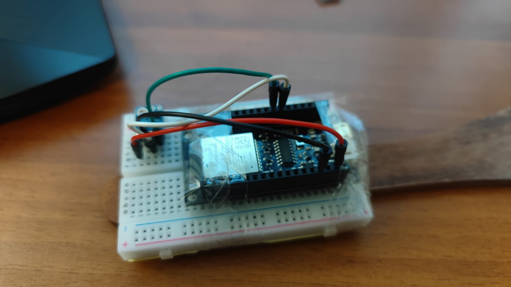
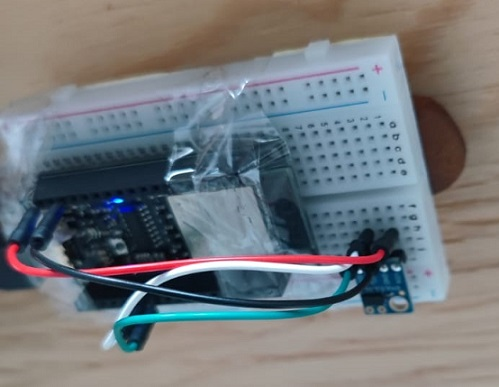
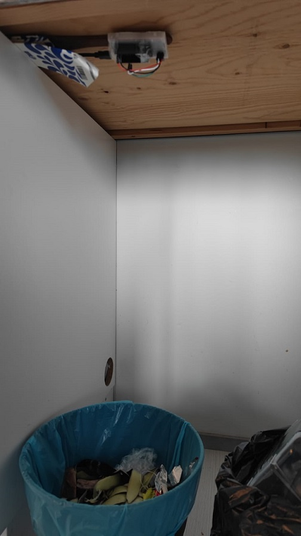
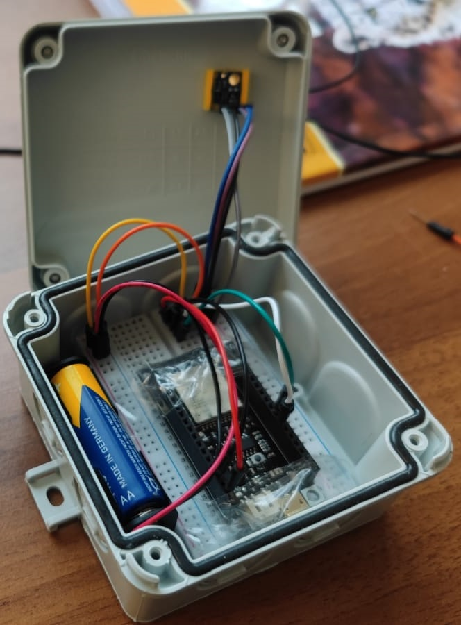

# Smart Trash bin monitoring system

## Introduction

The development and progression of human civilization brings forth many modern-day problems. As the population increases in a city, the city consumes more resources and in return produce even more waste products. As the technology and trends change, the cycle of people buying and discarding stuff continues. For some the major cities in the world the waste management has already turned into a major challenge. From waste segregation to proper disposal there are a great many challenges that the local authorities responsible have to face to get rid that waste. Even the collection and transportation of waste requires large amount of planning and management to pick up and dispose the waste.

Inefficient and untimely collection of waste will end up causing a loss of valuable time and resources and could potentially create a health hazard in the society.

The Smart Trashbin monitoring system presents a proof of concept where the system is used to monitor the trash level in the trash bins located across the city.

The system will generate data analytics and inform the user when it is time to empty the trash bins. The analytics generated can also be used to create an intelligent waste collection system that will create predictions and prepare route plans to collect waste as efficiently as possible.
 

## Project Objective

The idea behind this project is to create a system that monitors the trash level and generates some data analytics based on the condition of trash bin. The data is sent to the Losant’s IoT platform where it can be visualised.

Furthermore, a few advanced features were also implemented in the device’s firmware as well as to the platform which provide remote access to the node installed in the Trash bin in case the device requires some reconfiguration.

> *Full list of features and capabilities are listed in a separate section below.*

## Hardware used

-   ESP32 as the processing and transmission unit.
-   Lidar sensor (VL53L0X) and sensor unit (to measure the level of trash in the trash bin.)
-   Breadboard, for prototyping
-   Battery to power the nodes.

## Software used

-   Arduino IDE is used for firmware programming using Arduino C/C++ language.
-   The Losant Platform itself requires some process automation programming in its dedicated environment called workflows to support our advanced features. The GUI itself is interactive and fun to use.

## Features offered

### Basic features in version 1.0

There are a few basic features that were added to the ESP32’s firmware to make its connection more robust and reliable.

Our Node presents the following features…

-   Pre-sets the height of the trashcan in a variable which will help in calculating the level of trash in the trash bin.
-   Fetches the readings from the Laser sensor in high accuracy mode.
-   Hibernation enabled. Sleeps for 60 seconds before publishing the next readings.
-   Robust connection to Losant server
    -   The device sometimes gets dropped from the Losant server and is unable to connect back. To fix this, Robust timeout logic was created which retries connection to the server if communication with the Losant server fails.
-   Connects to the Losant server and pushes the Trash Level to the server.

### Advanced features in version 2.0

The following features were added to the device…

-   Added **Configuration storage and retrieval** from memory
-   Added default failover WiFi configuration in case the main Wifi router goes down.
-   Added **Auto Height calibration mode**. The device is now capable of detecting and calibrating itself according to the installed location with minimal interference from the user.
-   Added a **Debug mode** to print the status of the peripherals and the system.
-   Added **Interactive Dashboard** to **receive commands from the central system.** The device can now be re-configured Over the Air without the need to manually reprogram the device. The following features can be configured remotely…
    -   Update Node sleep duration from dashboard remotely.
    -   Change Node Wifi login credentials…
    -   Switch between Auto or manual height calibration modes.
    -   Manually update the height of the trash bin.
    -   Turn Debug mode on or off remotely.

### Platform side Updates

-   Added visualization showing real-time Trash full or empty percentage on the dashboard.
-   Added Warning system if Trashbin height changes when compared to calibrated height.
-   Added System temperature status on dashboard. ESP32 has an inbuilt temperature sensor.
-   Added Device Status indicator on the dashboard
-   Added Error message indicator on the dashboard
-   Added current sleep timer metric display on the dashboard
-   Added current Trashcan height metric display on the dashboard (useful in calibrating trashcan height)
-   Added current Sensor height metric display on the dashboard (useful in calibrating trashcan height)
-   Added disable sleep mode, set the timer to 0 to disable sleep and get real-time data.

> For more details please refer to the project’s wiki

 

## Testing…. Device pics
 

  

<!--- --->
 

**Device Mounted**

  

<!--- --->

 

**Adapting to the situation….**

  

<!--- --->

 

> **Note**: <em>The device is intended for large trash bins, for the sake of testing this is what we got… </em>

 
 

**Final Device Images**

  

<!---  --->
